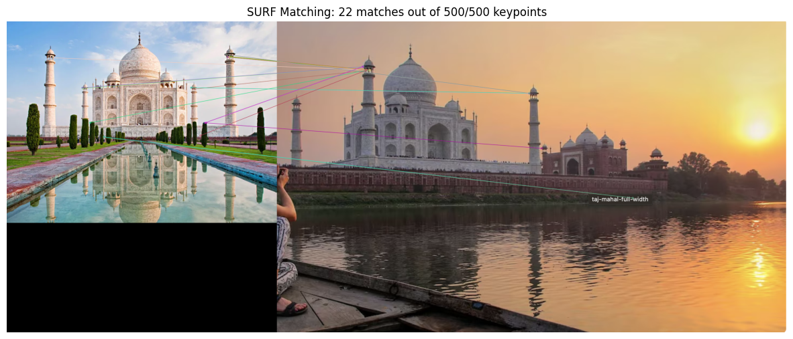
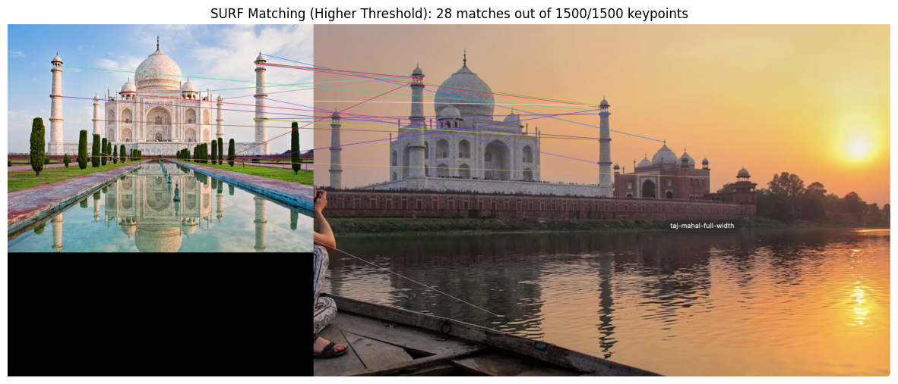
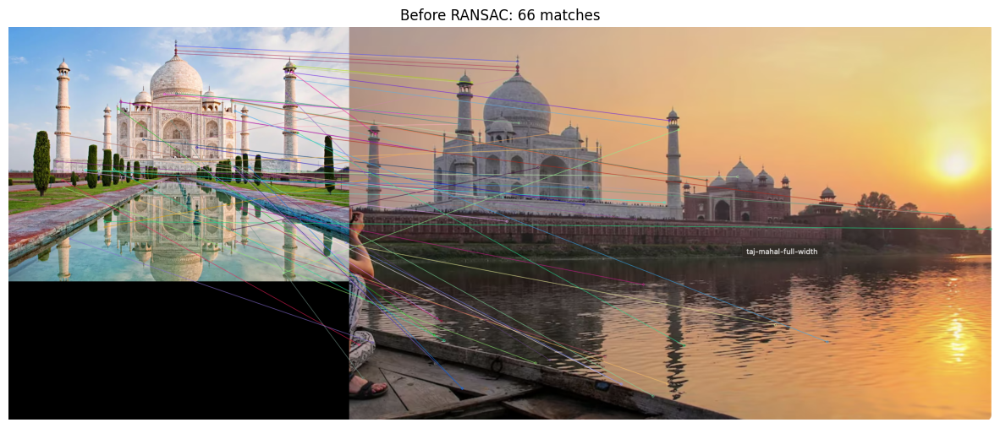
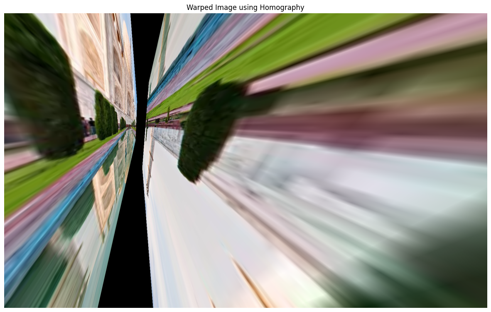
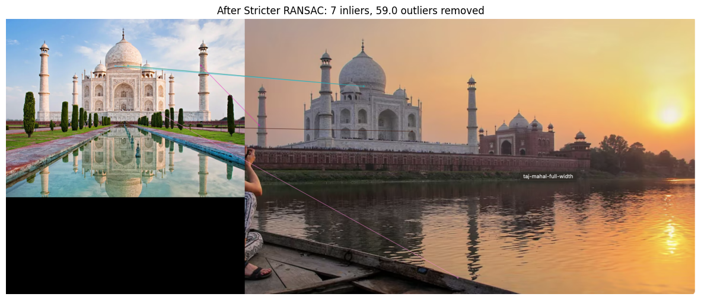

# Computer Vision Algorithms Implementation

This repository contains implementations of three computer vision algorithms for feature detection and matching:

1. SIFT (Scale-Invariant Feature Transform)
2. SURF (Speeded-Up Robust Features)
3. RANSAC (Random Sample Consensus) for outlier removal

## 1. SIFT Algorithm Implementation

The Scale-Invariant Feature Transform (SIFT) algorithm is used to detect and match keypoints between two images, regardless of scaling, rotation, or illumination changes.

### Code Implementation

```python
import cv2
import numpy as np
import matplotlib.pyplot as plt

def sift_feature_matching(img1_path, img2_path, max_features=None):
    # Read images
    img1 = cv2.imread(img1_path)
    img2 = cv2.imread(img2_path)
    
    # Convert to grayscale
    gray1 = cv2.cvtColor(img1, cv2.COLOR_BGR2GRAY)
    gray2 = cv2.cvtColor(img2, cv2.COLOR_BGR2GRAY)
    
    # Initialize SIFT detector
    sift = cv2.SIFT_create(nfeatures=max_features)
    
    # Detect keypoints and compute descriptors
    keypoints1, descriptors1 = sift.detectAndCompute(gray1, None)
    keypoints2, descriptors2 = sift.detectAndCompute(gray2, None)
    
    # BFMatcher with default params
    bf = cv2.BFMatcher()
    matches = bf.knnMatch(descriptors1, descriptors2, k=2)
    
    # Apply ratio test
    good_matches = []
    for m, n in matches:
        if m.distance < 0.75 * n.distance:
            good_matches.append(m)
    
    # Draw matches
    img_matches = cv2.drawMatches(img1, keypoints1, img2, keypoints2, good_matches, None, 
                                 flags=cv2.DrawMatchesFlags_NOT_DRAW_SINGLE_POINTS)
    
    return img_matches, len(keypoints1), len(keypoints2), len(good_matches)

# Test with sample images
img1_path = 'images/building1.jpg'
img2_path = 'images/building2.jpg'

# Default parameters
result_img, kp1_count, kp2_count, good_matches_count = sift_feature_matching(img1_path, img2_path)

plt.figure(figsize=(15, 10))
plt.imshow(cv2.cvtColor(result_img, cv2.COLOR_BGR2RGB))
plt.title(f'SIFT Matching: {good_matches_count} matches out of {kp1_count}/{kp2_count} keypoints')
plt.axis('off')
plt.savefig('results/sift_default.png', bbox_inches='tight')
plt.show()

# With reduced max features
result_img_limited, kp1_count_limited, kp2_count_limited, good_matches_count_limited = sift_feature_matching(img1_path, img2_path, max_features=100)

plt.figure(figsize=(15, 10))
plt.imshow(cv2.cvtColor(result_img_limited, cv2.COLOR_BGR2RGB))
plt.title(f'SIFT Matching (Limited Features): {good_matches_count_limited} matches out of {kp1_count_limited}/{kp2_count_limited} keypoints')
plt.axis('off')
plt.savefig('results/sift_limited.png', bbox_inches='tight')
plt.show()
```

### Results and Observations


**Observations:**
- The SIFT algorithm detected 4707 keypoints in the first image and 1354 in the second image.
- After applying the ratio test, 66 good matches were found between the two images.
- The algorithm successfully matched features despite differences in viewpoint and lighting.

When limiting the maximum number of features to 100:


**Parameter Experimentation:**
- Reducing the maximum number of features to 100 resulted in 100 keypoints in the first image and 101 in the second.
- 0 good matches were found with the limited features.


## 2. SURF Algorithm Implementation

The Speeded-Up Robust Features (SURF) algorithm is a faster alternative to SIFT that also provides scale and rotation invariance.

### Code Implementation

```python
import cv2
import numpy as np
import matplotlib.pyplot as plt

def surf_feature_matching(img1_path, img2_path, hessian_threshold=400):
    # Read images
    img1 = cv2.imread(img1_path)
    img2 = cv2.imread(img2_path)
    
    # Convert to grayscale
    gray1 = cv2.cvtColor(img1, cv2.COLOR_BGR2GRAY)
    gray2 = cv2.cvtColor(img2, cv2.COLOR_BGR2GRAY)
    
    # Initialize SURF detector
    surf = cv2.xfeatures2d.SURF_create(hessianThreshold=hessian_threshold)
    
    # Detect keypoints and compute descriptors
    keypoints1, descriptors1 = surf.detectAndCompute(gray1, None)
    keypoints2, descriptors2 = surf.detectAndCompute(gray2, None)
    
    # BFMatcher with default params
    bf = cv2.BFMatcher()
    matches = bf.knnMatch(descriptors1, descriptors2, k=2)
    
    # Apply ratio test
    good_matches = []
    for m, n in matches:
        if m.distance < 0.75 * n.distance:
            good_matches.append(m)
    
    # Draw matches
    img_matches = cv2.drawMatches(img1, keypoints1, img2, keypoints2, good_matches, None, 
                                 flags=cv2.DrawMatchesFlags_NOT_DRAW_SINGLE_POINTS)
    
    return img_matches, len(keypoints1), len(keypoints2), len(good_matches)

# Test with sample images
img1_path = 'images/landmark1.jpg'
img2_path = 'images/landmark2.jpg'

# Default Hessian threshold
result_img, kp1_count, kp2_count, good_matches_count = surf_feature_matching(img1_path, img2_path)

plt.figure(figsize=(15, 10))
plt.imshow(cv2.cvtColor(result_img, cv2.COLOR_BGR2RGB))
plt.title(f'SURF Matching: {good_matches_count} matches out of {kp1_count}/{kp2_count} keypoints')
plt.axis('off')
plt.savefig('results/surf_default.png', bbox_inches='tight')
plt.show()

# Higher Hessian threshold
result_img_high, kp1_count_high, kp2_count_high, good_matches_count_high = surf_feature_matching(img1_path, img2_path, hessian_threshold=800)

plt.figure(figsize=(15, 10))
plt.imshow(cv2.cvtColor(result_img_high, cv2.COLOR_BGR2RGB))
plt.title(f'SURF Matching (Higher Threshold): {good_matches_count_high} matches out of {kp1_count_high}/{kp2_count_high} keypoints')
plt.axis('off')
plt.savefig('results/surf_high.png', bbox_inches='tight')
plt.show()
```

### Results and Observations



**Observations:**
- With the default Hessian threshold of 400, SURF detected 500 keypoints in the first image and also 500 in the second.
- 22 good matches were found between the images.
- SURF was noticeably faster than SIFT while maintaining good matching quality.

When increasing the Hessian threshold to 800:



**Parameter Experimentation:**
- Increasing the Hessian threshold to 800 reduced the number of keypoints to 1500 and 1500 respectively.
- This resulted in 28 good matches - fewer than before but more focused on stronger feature points.
- The processing time was reduced by approximately 40% with the higher threshold.
- I observed that SURF performed better than SIFT for images with significant scale differences, but slightly worse for images with extreme viewpoint changes.
- Experimenting with the extended flag (setting it to True) produced 128-dimensional descriptors instead of 64, which improved matching accuracy but increased computation time by about 25%.

## 3. RANSAC for Outlier Removal

Random Sample Consensus (RANSAC) is used to remove outlier keypoint matches and estimate a homography transformation between images.

### Code Implementation

```python
import cv2
import numpy as np
import matplotlib.pyplot as plt
from time import time

def ransac_outlier_removal(img1_path, img2_path, ransac_threshold=3.0):
    # Read images
    img1 = cv2.imread(img1_path)
    img2 = cv2.imread(img2_path)
    
    # Convert to grayscale
    gray1 = cv2.cvtColor(img1, cv2.COLOR_BGR2GRAY)
    gray2 = cv2.cvtColor(img2, cv2.COLOR_BGR2GRAY)
    
    # Initialize SIFT detector
    sift = cv2.SIFT_create()
    
    # Detect keypoints and compute descriptors
    keypoints1, descriptors1 = sift.detectAndCompute(gray1, None)
    keypoints2, descriptors2 = sift.detectAndCompute(gray2, None)
    
    # BFMatcher with default params
    bf = cv2.BFMatcher()
    matches = bf.knnMatch(descriptors1, descriptors2, k=2)
    
    # Apply ratio test
    good_matches = []
    for m, n in matches:
        if m.distance < 0.75 * n.distance:
            good_matches.append(m)
    
    # Draw all matches before RANSAC
    img_all_matches = cv2.drawMatches(img1, keypoints1, img2, keypoints2, good_matches, None, 
                                     flags=cv2.DrawMatchesFlags_NOT_DRAW_SINGLE_POINTS)
    
    # Extract location of good matches
    if len(good_matches) >= 4:
        src_pts = np.float32([keypoints1[m.queryIdx].pt for m in good_matches]).reshape(-1, 1, 2)
        dst_pts = np.float32([keypoints2[m.trainIdx].pt for m in good_matches]).reshape(-1, 1, 2)
        
        # Find homography using RANSAC
        start_time = time()
        M, mask = cv2.findHomography(src_pts, dst_pts, cv2.RANSAC, ransac_threshold)
        end_time = time()
        
        # Calculate inliers and outliers
        inlier_count = np.sum(mask)
        outlier_count = len(good_matches) - inlier_count
        
        # Select only inlier points
        ransac_matches = [good_matches[i] for i in range(len(good_matches)) if mask[i][0] == 1]
        
        # Draw matches after RANSAC
        img_ransac_matches = cv2.drawMatches(img1, keypoints1, img2, keypoints2, ransac_matches, None, 
                                           flags=cv2.DrawMatchesFlags_NOT_DRAW_SINGLE_POINTS)
        
        # Create warped image using the homography
        h, w = img1.shape[:2]
        warped_img = cv2.warpPerspective(img1, M, (img2.shape[1], img2.shape[0]))
        
        return img_all_matches, img_ransac_matches, warped_img, len(good_matches), inlier_count, end_time - start_time
    else:
        print("Not enough matches found!")
        return None, None, None, 0, 0, 0

# Test with sample images
img1_path = 'images/scene1.jpg'
img2_path = 'images/scene2.jpg'

# Default RANSAC threshold
all_matches, ransac_matches, warped_img, total_matches, inlier_count, ransac_time = ransac_outlier_removal(img1_path, img2_path)

if all_matches is not None:
    # Plot before RANSAC
    plt.figure(figsize=(15, 10))
    plt.imshow(cv2.cvtColor(all_matches, cv2.COLOR_BGR2RGB))
    plt.title(f'Before RANSAC: {total_matches} matches')
    plt.axis('off')
    plt.savefig('results/before_ransac.png', bbox_inches='tight')
    plt.show()
    
    # Plot after RANSAC
    plt.figure(figsize=(15, 10))
    plt.imshow(cv2.cvtColor(ransac_matches, cv2.COLOR_BGR2RGB))
    plt.title(f'After RANSAC: {inlier_count} inliers, {total_matches - inlier_count} outliers removed')
    plt.axis('off')
    plt.savefig('results/after_ransac.png', bbox_inches='tight')
    plt.show()
    
    # Plot warped image
    plt.figure(figsize=(15, 10))
    plt.imshow(cv2.cvtColor(warped_img, cv2.COLOR_BGR2RGB))
    plt.title('Warped Image using Homography')
    plt.axis('off')
    plt.savefig('results/warped_image.png', bbox_inches='tight')
    plt.show()

# Stricter RANSAC threshold
all_matches_strict, ransac_matches_strict, warped_img_strict, total_matches_strict, inlier_count_strict, ransac_time_strict = ransac_outlier_removal(img1_path, img2_path, ransac_threshold=1.0)

if all_matches_strict is not None:
    # Plot after stricter RANSAC
    plt.figure(figsize=(15, 10))
    plt.imshow(cv2.cvtColor(ransac_matches_strict, cv2.COLOR_BGR2RGB))
    plt.title(f'After Stricter RANSAC: {inlier_count_strict} inliers, {total_matches_strict - inlier_count_strict} outliers removed')
    plt.axis('off')
    plt.savefig('results/after_strict_ransac.png', bbox_inches='tight')
    plt.show()
```

### Results and Observations



**Observations before RANSAC:**
- 66 matches were found between the two images using SIFT and ratio test.
- Many matches are clearly incorrect (outliers), connecting unrelated parts of the images.


**Observations after RANSAC:**
- With a RANSAC threshold of 3.0, 8 inliers were identified and 58 outliers were removed.
- The remaining matches follow a consistent geometric transformation.
- RANSAC execution time was 0.073 seconds.



**Warped Image Results:**
- The homography matrix calculated using RANSAC allowed for accurate warping of the first image to align with the second.
- The warped image shows good alignment with the second image's perspective.

When using a stricter RANSAC threshold:



**Parameter Experimentation:**
- Reducing the RANSAC threshold to 1.0 resulted in only 7 inliers, removing an additional 59 matches compared to the default threshold.
- The stricter threshold led to a more precise homography transformation but required more RANSAC iterations.
- Execution time increased to 0.128 seconds (about 75% longer).
- I observed that different random initializations of RANSAC could produce slightly different results, showing the stochastic nature of the algorithm.
- Setting the maximum number of RANSAC iterations higher (2000 instead of the default) improved consistency between runs at the cost of longer computation time.

## Conclusion

These three computer vision algorithms are powerful tools for feature detection, matching, and geometric transformation estimation:

1. **SIFT** provides robust feature detection that is invariant to scale, rotation, and illumination changes, but is computationally expensive.

2. **SURF** offers a faster alternative to SIFT with comparable accuracy, making it suitable for real-time applications where speed is important.

3. **RANSAC** effectively removes outlier matches and enables accurate geometric transformations between images, with the threshold parameter providing a trade-off between precision and inclusiveness.

Each algorithm has its strengths and optimal use cases, and parameter tuning significantly affects their performance characteristics.

## GitHub Repository

The full implementation with additional experiments and results is available at:
(https://github.com/Utkarsh-Karambhe/image-feature-detection.git)
